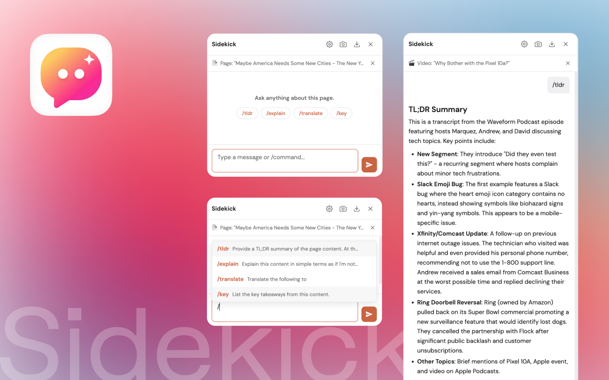
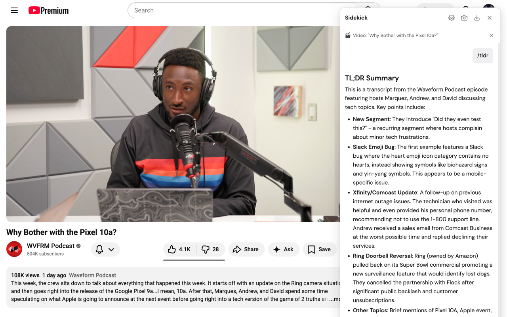
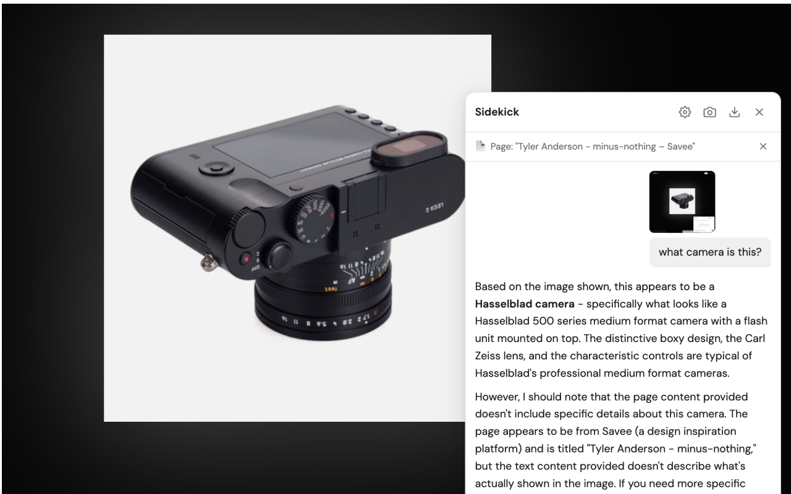
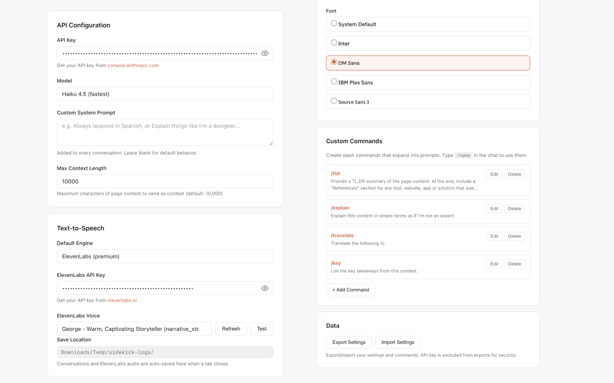

<p align="center">
  
</p>

<h1 align="center">Sidekick</h1>

<p align="center">Chat with AI about any webpage.<br>
Extracts page content and YouTube transcripts as context automatically.</p>

<p align="center">Chrome · Manifest V3 · Uses your own API key</p>
<p align="center"><a href="#install"><strong>Install Sidekick</strong></a></p>

<p align="center">
  
</p>

## Install

1. Clone or download this repository
2. Open `chrome://extensions` in Chrome
3. Enable **Developer mode** (top-right toggle)
4. Click **Load unpacked** and select the project folder
5. Click the extension icon on any page to open the chat
6. Click the gear icon to enter your [API key](https://console.anthropic.com/settings/keys)

## Features

**Automatic context extraction** — Open Sidekick on any webpage and it reads the page content for you. On YouTube, it grabs the full transcript with timestamps instead. Ask questions, get summaries, or analyze what you're reading — the AI already knows what's on the page.

<p align="center">
  
</p>

**Screenshot capture** — Click the camera button to screenshot the visible page and ask about what you see. Uses the same vision pipeline as drag-and-drop images.

<p align="center">
  
</p>

**Slash commands** — Type `/tldr` for a summary, `/explain` for a simple breakdown, `/key` for takeaways, or `/translate` to translate. Create your own custom commands in Settings. Commands appear as clickable pills on the welcome screen.

**Text-to-Speech** — Listen to any response with browser voices (free) or ElevenLabs (premium). Play, pause, and resume controls on each message.

<p align="center">
  
</p>

**Floating button** — Enable a small Sidekick button that sits in the corner of every page. Click it to open the chat instantly, no toolbar icon needed. Toggle it on or off in Settings under Appearance.

Also: drag-and-drop images · streaming responses · markdown rendering · auto-save conversations on tab close · multiple models · custom system prompt · dark mode · resizable window · font selection · conversation download · settings export/import · per-tab isolation · Shadow DOM isolation

## Usage

**Open the chat** — Click the extension icon in the toolbar. The chat window appears in the bottom-right corner at full height.

**Ask about the page** — The page content is automatically loaded as context. Ask questions and it will reference it.

**Use commands** — Type `/tldr` to get a summary, `/explain` for a simple explanation, `/key` for key takeaways, or `/translate [language]` to translate. Or click any command pill on the welcome screen.

**Take a screenshot** — Click the camera icon in the header to capture the visible page. The screenshot appears as a preview — type a question about it and send.

**Send images** — Drag and drop an image into the chat window. It appears as a preview below the input. Send a message to analyze the image.

**Listen to responses** — Hover over any assistant message and click "Speak" to hear it read aloud. Click "Pause" to pause, "Resume" to continue. Configure the voice engine in Settings.

**Copy a response** — Hover over any assistant message and click the "Copy" button that appears below it.

**Download conversation** — Click the download icon in the header to save the conversation as a markdown file.

**Discard context** — Click the X on the context banner if you want to chat without page context.

**Close** — Click the X button to hide the chat. The conversation is preserved until you close or navigate away from the tab.

## Settings

Open settings via the gear icon in the chat header, or from `chrome://extensions` > Sidekick > Options.

| Setting | Description |
|---------|-------------|
| **API Key** | Your API key (starts with `sk-ant-`) |
| **Model** | Opus 4 (smartest), Sonnet 4 (recommended), Haiku 4.5 (fastest), Haiku 3.5 (budget) |
| **Custom System Prompt** | Instructions added to every conversation (optional) |
| **Max Context** | Maximum characters of page content to send (default: 10,000) |
| **TTS Engine** | Browser (free) or ElevenLabs (premium) |
| **Browser Voice** | Select from available system voices, grouped by language |
| **ElevenLabs API Key** | Your ElevenLabs key for premium voice synthesis |
| **ElevenLabs Voice** | Choose from available ElevenLabs voices |
| **Save Location** | Conversations auto-save to `Downloads/Temp/sidekick-logs/` on tab close |
| **Floating Button** | Show a small Sidekick button on every page to open the chat |
| **Theme** | Auto (follows system), Light, or Dark |
| **Font** | Choose the chat font from 5 options |
| **Commands** | Add, edit, or delete custom slash commands |
| **Export/Import** | Back up settings and commands as JSON (API key excluded for security) |

## Commands

Sidekick ships with four built-in commands:

| Command | What it does |
|---------|-------------|
| `/tldr` | Summarize the page content |
| `/explain` | Explain the content in simple terms |
| `/key` | List key takeaways |
| `/translate [language]` | Translate content to a language |

Add text after any command to refine it — e.g. `/tldr 3 bullet points`.

These are just defaults. You can edit them, delete them, or create entirely new ones in Settings. Custom commands appear as clickable pills on the welcome screen alongside the built-in ones.

## File Structure

```
sidekick/
  manifest.json      Extension config (Manifest V3)
  background.js      Service worker (icon click, settings, screenshot capture, conversation auto-save)
  content.js         Content script (Shadow DOM UI, page extraction, resize, images, TTS controls)
  chat.js            API streaming, message history, markdown, commands
  tts.js             Text-to-Speech engine (browser voices + ElevenLabs)
  youtube.js         YouTube transcript extraction
  chat.css           Chat window styles (loaded inside Shadow DOM)
  options.html       Settings page
  options.js         Settings logic (including TTS configuration)
  options.css        Settings page styles
  icons/             Extension icons (16, 32, 48, 128px)
```

## How It Works

- Clicking the extension icon sends a message to the content script, which creates a Shadow DOM container on the page
- The Shadow DOM isolates the chat UI from the host page's CSS and JavaScript
- Page content is extracted by cloning the body, stripping non-content elements (nav, footer, scripts, ads), and taking the inner text
- On YouTube, the transcript is extracted using YouTube's internal transcript API, with a fallback method that intercepts caption network requests via PerformanceObserver
- Screenshots use `chrome.tabs.captureVisibleTab()` and are sent through the same vision pipeline as drag-and-drop images
- API calls go directly from the browser using the `anthropic-dangerous-direct-browser-access` header for CORS — no proxy server needed
- TTS uses the Web Speech API for free browser voices, or ElevenLabs REST API for premium voices with MP3 caching per message
- Conversations are synced to `chrome.storage.local` after each assistant response and auto-saved to disk when a tab closes

## Privacy

This extension is designed to keep your data local. Here's exactly what happens:

**What stays on your device:**
- Your API key (stored in `chrome.storage.local`, never transmitted anywhere except the API)
- Your ElevenLabs API key (same — only sent to ElevenLabs when TTS is used)
- Settings, custom commands, and UI preferences
- Saved conversations and audio files (in `Downloads/Temp/sidekick-logs/`)

**What gets sent to the API (`api.anthropic.com`):**
- Your messages and conversation history (for the current tab)
- Page content or YouTube transcript, if context is active
- Images and screenshots you attach (as base64)
- API calls go directly from your browser — the API provider can see your IP address

**What gets sent to ElevenLabs (`api.elevenlabs.io`) — only if you enable ElevenLabs TTS:**
- The text of assistant messages you click "Speak" on
- Your ElevenLabs API key for authentication

**What gets sent to Google (`fonts.googleapis.com`):**
- A font request only when you select a non-system font in settings. If you use "System Default" (the default), no request to Google is made.

**What is NOT collected:**
- No analytics, telemetry, or tracking of any kind
- No data sent to any server other than Anthropic (and optionally ElevenLabs and Google Fonts)
- No browsing history or page URLs are stored or transmitted (URLs are only included in the system prompt when context is active)
- Settings exports exclude your API keys

## Requirements

- Chrome (or Chromium-based browser)
- An [API key](https://console.anthropic.com/settings/keys) from Anthropic
- (Optional) An [ElevenLabs API key](https://elevenlabs.io) for premium text-to-speech

## License

[MIT](LICENSE)
