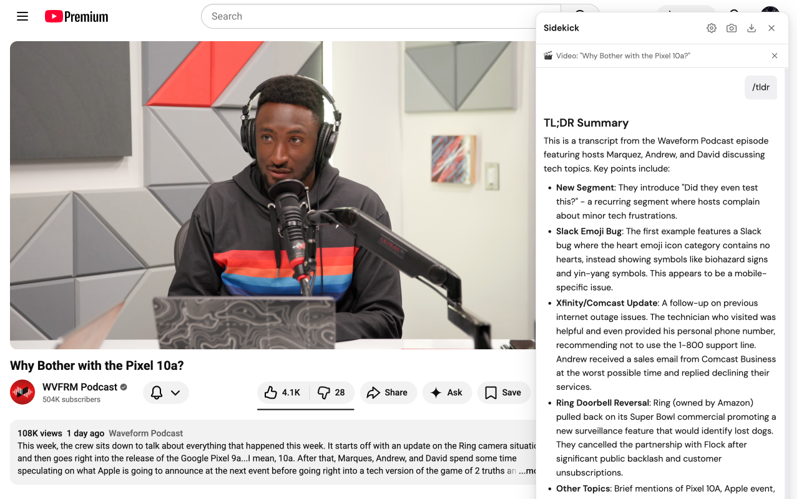
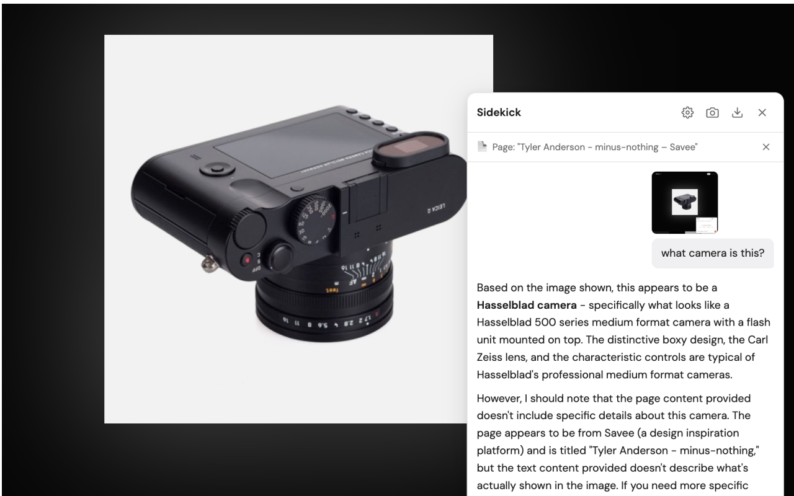
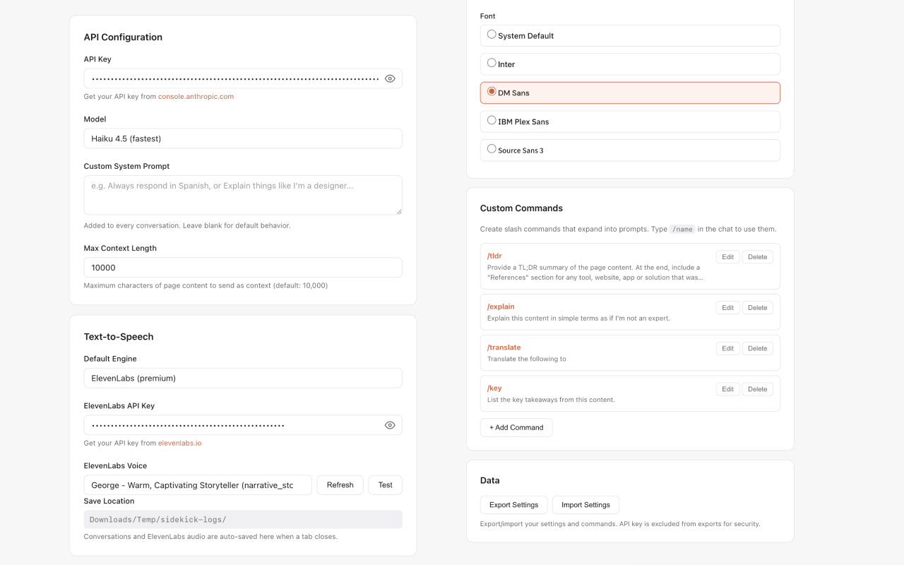

  

<h1 align="center">Sidekick</h1>

Chat with AI about the page you're reading. 
A private floating chat. Not an AI browser, not a sidebar. Bring your own API key.

Chrome · Manifest V3

  

https://github.com/user-attachments/assets/7db58286-4408-4089-ad71-3491e354b1b4

---

Most AI browser integrations prioritize convenience over privacy. Some AI Chrome extensions are decent, but they usually just are sidebar chats. My use cases are simple: I'm reading something or watching a video, and I want to act on that content, either save it, summarize it, or run it through different commands/prompts. It doesn't need to proactively take screenshots of what I'm doing or read my content. I built Sidekick with all of this in mind.

It works as a floating chat that imports the content of the tab when it was triggered at the moment you send your first message but you can clear that context if it's irrelevant for your message. It also is able to take screenshots of the active tab if you need the context to be visual. You can import local files as well. Every conversation is optionally saved locally so summaries or specific workflows are never lost. You can even use your ElevenLabs API key if you want to listen to the answers instead of reading them, which is useful if what you want is to "listen to articles" like you do with services like Speechify.

The real strength comes with your custom commands, which are shortcuts for reusable prompts.

Sidekick is not for people who want an autonomous browsing agent. It's for those who want to power up their browsing experience without sacrificing privacy.

## Install

1. Clone or download this repository
2. Open `chrome://extensions` in Chrome
3. Enable **Developer mode** (top-right toggle)
4. Click **Load unpacked** and select the project folder
5. Click the extension icon on any page to open the chat
6. Click the gear icon to enter your [API key](https://console.anthropic.com/settings/keys)

## Keyboard shortcut

Sidekick doesn't ship a default shortcut. To assign one, go to `chrome://extensions/shortcuts` (or `brave://extensions/shortcuts` on Brave) and bind the Sidekick action to any key combination. Same path works on Edge and other Chromium-based browsers.

## Features

### Automatic context extraction
Open Sidekick on any webpage and it reads the page content for you. Ask questions, get summaries, or analyze what you're reading. The AI already knows what's on the page.

  

### Screenshot capture
Click the camera button to capture the visible page and ask about what you see. Uses the same vision pipeline as drag-and-drop images.

  

### Slash commands
Built-in: `/tldr` (summarize), `/explain` (simple breakdown), `/key` (takeaways), `/translate [language]`. Add text after any command to refine it. Example: `/tldr 3 bullet points`. Commands appear as clickable pills on the welcome screen.

Create your own in Settings. Edit or delete the built-ins if you don't like them.

### Text-to-speech
Hover any assistant response and click **Speak** to hear it read aloud. Free with browser voices, or plug in an ElevenLabs key for premium synthesis. Play, pause, and resume controls on each message.

  

### Floating button
Enable a small Sidekick button that sits in the corner of every page so you can open the chat without hunting for the toolbar icon. Toggle it under **Settings → Appearance**.

### Also
Drag-and-drop images, streaming responses, markdown rendering, auto-save conversations on tab close, multiple models, custom system prompt, dark mode, resizable window, font selection, conversation download, settings export/import, per-tab isolation, Shadow DOM isolation.

## Settings

Open via the gear icon in the chat header, or from `chrome://extensions` → Sidekick → Options.

| Setting | Description |
|---------|-------------|
| **API Key** | Your Anthropic API key (starts with `sk-ant-`) |
| **Model** | Opus 4 (smartest), Sonnet 4 (recommended), Haiku 4.5 (fastest), Haiku 3.5 (budget) |
| **Custom System Prompt** | Added to every conversation (optional) |
| **Max Context** | Maximum characters of page content to send (default: 10,000) |
| **TTS Engine** | Browser (free) or ElevenLabs (premium) |
| **Browser Voice** | Select from available system voices, grouped by language |
| **ElevenLabs API Key** | Your ElevenLabs key for premium voice synthesis |
| **ElevenLabs Voice** | Choose from available ElevenLabs voices |
| **Save Location** | Conversations auto-save to `Downloads/Temp/sidekick-logs/` on tab close |
| **Floating Button** | Show a small Sidekick button on every page |
| **Theme** | Auto (follows system), Light, or Dark |
| **Font** | Choose the chat font from 5 options |
| **Commands** | Add, edit, or delete custom slash commands |
| **Export/Import** | Back up settings and commands as JSON (API key excluded for security) |

## Commands

| Command | What it does |
|---------|-------------|
| `/tldr` | Summarize the page content |
| `/explain` | Explain the content in simple terms |
| `/key` | List key takeaways |
| `/translate [language]` | Translate content to a language |

Add text after any command to refine it. Create your own in Settings.

## Privacy

There is no Sidekick server. API keys, conversations, and settings stay in `chrome.storage.local`. Nothing leaves the browser unless you send a message or click **Speak**.

- Messages, page content, and any attached images go directly from your browser to `api.anthropic.com`. Anthropic sees your IP address.
- TTS text and the ElevenLabs key go to `api.elevenlabs.io` only when you enable ElevenLabs and click **Speak**.
- Non-system fonts load from `fonts.googleapis.com`. The default "System Default" option makes no Google request.
- No analytics, telemetry, tracking, or browsing-history collection. Settings exports exclude API keys.

## Requirements

- Chrome (or Chromium-based browser)
- An [Anthropic API key](https://console.anthropic.com/settings/keys)
- (Optional) An [ElevenLabs API key](https://elevenlabs.io) for premium text-to-speech

## Known limitations

- **Page extraction is heuristic.** Content is extracted by cloning the DOM and stripping non-content elements (nav, footer, scripts, ads). Sites with unusual DOM structures or heavy client-side rendering may return partial context. Bump **Max Context** in Settings if you're seeing truncated input.
- **Max Context defaults to 10,000 characters.** Very long articles get truncated. Raise the limit in Settings when working with long-form content.

## Tech stack

- Chrome Manifest V3. Vanilla JavaScript, no framework, no build step.
- Anthropic REST API. Chat completions and vision, called directly from the browser via `fetch` with the `anthropic-dangerous-direct-browser-access` header.
- Web Speech API + ElevenLabs REST API for TTS.
- Shadow DOM for UI isolation from the host page's CSS and JavaScript.
- Zero npm dependencies.

## Feedback

Found a bug or have a feature idea? [Open an issue](https://github.com/madebysan/sidekick/issues).

## License

[MIT](LICENSE)

---

Made by [santiagoalonso.com](https://santiagoalonso.com)
